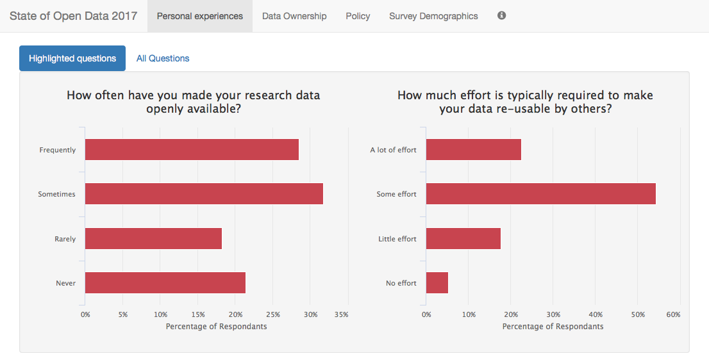

# State of Open Data Survey 2017 Shiny App

This interactive Shiny app is a companion to the [State of Open Data Report for 2017](https://doi.org/10.6084/m9.figshare.5481187), compiled through collaboration between Figshare, Springer Nature and Wiley. The underlying raw survey data is made available [here](https://doi.org/10.6084/m9.figshare.5480710).

Read more about this collaboration between Figshare and the IDN [here](https://knowledge.figshare.com/articles/item/state-of-open-data-2017).

</img>

This code is deposited [here](https://doi.org/10.6084/m9.figshare.5537263) under a CCBY4.0 license.